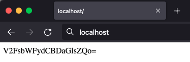

# Webserver Nginx Docker de respuesta a desafío SRE

Este repositorio contiene un Dockerfile para construir una imagen Docker con un servidor web Nginx y un archivo de index.html que contiene mi nombre en base 64.

## Instrucciones

Paso 1:

Para construir la imagen Docker, clona el repositorio a un directorio en tu computadore, posicionandote en este directorio, ejecuta el siguiente comando desde una terminal:

```bash
    docker buildx build . -t "mi-nginx"
```

Esto construirá la imagen utilizando el Dockerfile y la etiquetará como "mi-webserver-nginx".

Paso 2:

Luego, para ejecutar un contenedor basado en esta imagen, puedes usar el siguiente comando:

```bash
    docker run -p 8080:80 mi-nginx
```

Esto mapea el puerto 8080 de tu máquina host al puerto 80 del contenedor Nginx. Puedes cambiar los números de puerto según tus preferencias.

Paso 3: 

Después de ejecutar el contenedor, puedes acceder a tu servidor web Nginx visitando http://localhost:8080 en tu navegador, obteniendo un resultado como en este ejemplo:



Paso 4:

Una vez visto el código, puedes decodificar el contenido por 2 vías.

a) copiando el texto y ejecutando en un terminal la sigueinte instrucción:

```bash
echo "textocifrado" | base64 -d
```

b) ejecutando en la terminal el siguiente comando:

```bash
curl -sL http://localhost | base64 -d
```

Con esto, podrás ver que el servicio contiene mi nombre.

## Revisión en Docker Hub

Esta imagen está presente en Docker Hub. Verifica su existencia siguiendo el enlace:

https://hub.docker.com/repository/docker/lupinbustamante/mi-nginx